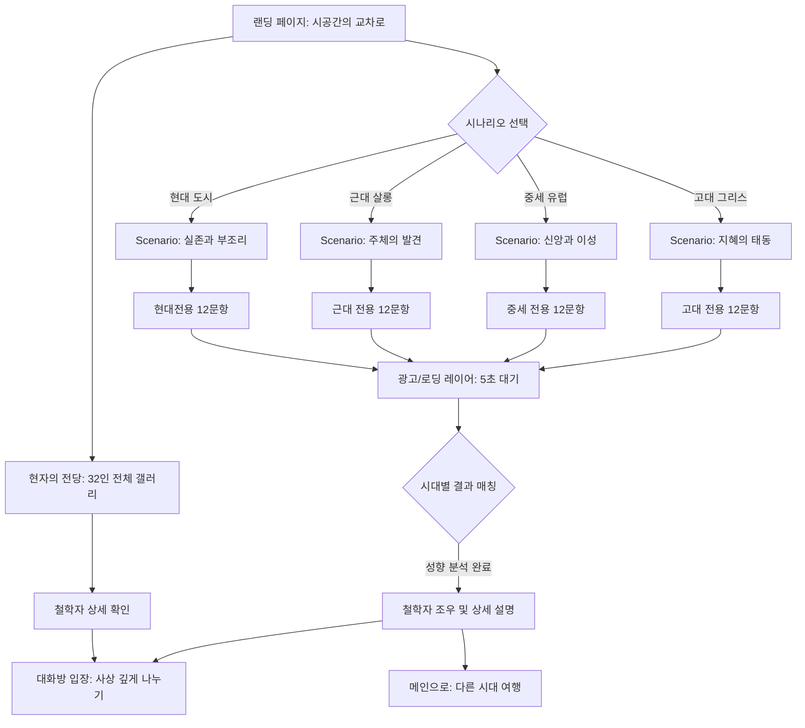

# [기획안] 시간의 광장: 현자의 방 (Project 2)

본 프로젝트는 기존 '철학자의 방' 프로젝트의 기술 부채를 해결하고, 고도로 몰입감 넘치는 스토리텔링 기반의 철학자 매칭 및 대화 경험을 제공하는 웹 애플리케이션입니다.

## 1. 프로젝트 개요
- **목표**: 사용자가 '고대, 중세, 근대, 현대' 중 하나를 선택하여, 각 시대별 **12개의 심도 있는 질문**을 통해 철학자와 매칭되는 전문적인 시나리오 기반 경험 제공.
- **핵심 가치**: 학술적 근거에 기반한 12단계 질문 설계, 시대별 특화된 내러티브, 프리미엄 UI.
- **주요 타겟**: 철학적 깊이를 선호하고 성향 테스트의 신뢰도를 중시하는 사용자.

## 2. 주요 기능 및 특징

### 2.1. 시대별 독립 시나리오 (12-Step Quest)
- **4대 독립 시나리오**: 각 시대별로 12개의 독자적인 질문 세트 보유 (총 48개 질문).
- **심화된 질문 설계**: 단순한 선택지가 아닌, 실제 해당 시대의 주요 철학적 논쟁(예: 보편논쟁, 심신이원론 등)을 반영한 질문 구성.
- **정교한 매칭 알고리즘**: 12개의 답변을 분석하여 32인 중 가장 가까운 성향을 도출.

### 2.2. 컨텐츠 전문성 강화
- **철학적 텍스트 연출**: 각 시대 현자의 말투와 고전적 어휘를 반영한 타자기 효과 연출.
- **시대별 몰입형 배경**: (고대) 아크로폴리스, (중세) 파리 대학 서고, (근대) 쾨니히스베르크의 산책길, (현대) 파리의 카페 등 상징적 장소 구현.

### 2.3. 현자의 갤러리 및 대화방
- **32인의 전당**: 모든 철학자를 한눈에 볼 수 있는 그리드 뷰.
- **심화 대화 모드**: 매칭된 철학자 혹은 선택한 철학자와 가상 대화를 나누는 정적 서비스 (준비된 답변 기반).

### 2.4. 수익화 모델 고려 (AdSense Friendly)
- **결과 페이지 진입 전 광고**: 결과 도출 직전 5초간의 '광고/대기' 시간을 통해 수익성 확보 및 기대감 고조.

---

## 3. 유저 플로우 차트 (User Flowchart)

사용자가 앱에 접속하여 시나리오를 선택하고 12개의 질문을 거쳐 결과에 이르는 흐름입니다.

## 4. 질문 설계 전략 (Question Design)

각 시나리오는 다음과 같은 테마의 12문항으로 구성됩니다:
1. **서사적 진입 (1-2)**: 시대적 배경 속에 사용자를 위치시키는 상황 제시.
2. **핵심 형이상학 (3-5)**: 세계의 본질, 신, 존재에 대한 가치관 확인.
3. **윤리학 및 정치학 (6-8)**: 올바른 삶의 태도, 국가와 개인의 관계 문항.
4. **인식론 및 실존 (9-11)**: 진리를 찾는 방법, 고독과 죽음에 대한 태도.
5. **최종 결단 (12)**: 해당 시대를 관통하는 가장 결정적인 질문.

---

## 4. 기술 스택 (Technical Stack)
- **Frontend**: Vanilla JS (ES6+), HTML5 Semantic Tags, CSS3 (Premium Glassmorphism).
- **Assets**: 이미지 및 폰트 (Google Fonts: Cinzel, Outfit, Noto Serif KR).
- **Storage**: 브라우저 로컬 스토리지를 활용한 진행 상황 저장 (선택 사항).

## 5. 단계별 실행 계획 (Milestones)
- [x] **Phase 1**: 핵심 UI 프레임워크 구축 (CSS 변수, Glassmorphism, 레이아웃).
- [x] **Phase 2**: 32인 철학자 데이터셋 및 48문항 퀘스트 시나리오 구축.
- [x] **Phase 3**: 퀘스트 엔진 고도화 (오디오 샘플 기반 타자기 효과, 전환 애니메이션).
- [/] **Phase 4**: 리소스 및 심화 기능 (32인 예술적 초상화 단독 적용 진행 중, 실시간 통계 '광장의 소리' 기초).
- [ ] **Phase 5**: 최종 폴리싱, 광고 배치 최적화 및 실서비스 배포.

## 6. 개발 도구 및 플랫폼 분류

| 분류 | 플랫폼/도구 | 용도 | 필수 여부 |
| :--- | :--- | :--- | :--- |
| **개발/AI** | Antigravity | 코드 구현, 디자인 최적화, 콘텐츠 생성 | 필수 |
| **코드 관리** | GitHub | 버전 관리 (Commit 기록), 협업 도구 | 필수 |
| **호스팅/배포** | GitHub Pages / Vercel | 웹 서비스 실시간 배포 및 도메인 연결 | 필수 |
| **수익화** | Google AdSense | 광고 삽입 및 수익 창출 | 필수 |
| **데이터베이스** | Supabase | 실시간 통계(광장의 소리), 유저 데이터 저장 | 선택 (통계 기능 시 필수) |
| **분석/SEO** | Google Analytics / Search Console | 트래픽 분석 및 검색 노출 최적화 | 선택 |

## 7. 향후 확장 계획 (Future Roadmap)

- **데일리 '현자의 예언'**: 사용자가 전화번호나 SNS를 연동하면, 매칭된 철학자의 명언을 특정 시간에 자동으로 발송하는 푸시 서비스.
- **커뮤니티 '아고라'**: 같은 철학자가 나온 사람들끼리 익명으로 대화를 나눌 수 있는 커뮤니티 공간 구축.
- **다국어 확장**: 글로벌 트래픽 확보를 위한 영어/일본어 버전 출시.

---

## 8. 현재 진행 및 후속 계획 요약 (Summary)

> [!IMPORTANT]
> **현재 상태**: 핵심 엔진 작동 중. 타자기 소리를 실제 샘플 파일로 교체 작업 예정.
> 
> **우선 과제 (Next Focus)**:
> 1. **잔여 초상화 단독화 (8인)**: 이미지 생성 쿼터 복구 시 현대 철학자(키에르케고르, 쇼펜하우어, 사르트르, 하이데거, 푸코, 아렌트, 비트겐슈타인, 마르크스) 단독 초상화 적용.
> 2. **광장의 소리(통계) 실구현**: Supabase 연동을 통해 실제 참여자 통계 데이터를 수집하고 결과 화면에 시각화.
> 3. **광고 배치 최적화**: 로딩 화면 및 결과 하단 AdSense 영역 디자인 고도화.
> 4. **최종 배포**: Vercel 또는 GitHub Pages를 통한 서비스 런칭.
